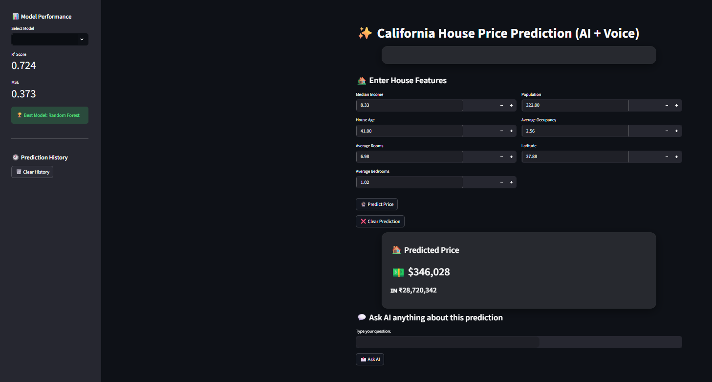
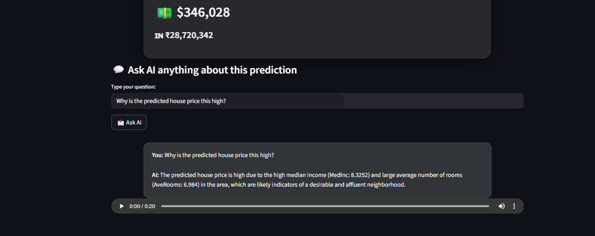

# 🏠 California House Price Prediction ML App

A full-stack **Machine Learning application** that predicts California housing prices and provides **AI-powered explanations** for predictions.

This project combines **Machine Learning, FastAPI backend, and Streamlit frontend** to create an interactive dashboard for real-time house price prediction.

---

# 🚀 Features

* Predict California house prices using trained ML models
* Model comparison (**Linear Regression, Decision Tree, Random Forest**)
* Display **Model Metrics (R² Score & MSE)**
* Interactive **Streamlit dashboard UI**
* **AI assistant** to explain predictions
* **Voice output** for AI explanations
* **Prediction history tracking**
* Automatic **USD → INR price conversion**

---

# 🖼️ Dashboard Screenshots

## Main Prediction Dashboard



## AI Explanation Chat



---

# 🧠 Machine Learning Workflow

1. Data Cleaning & Preprocessing
2. Exploratory Data Analysis (EDA)
3. Outlier Detection using **IQR Method**
4. Feature Scaling (Standardization)
5. Multicollinearity Check (**VIF**)
6. Model Training

### Models Used

* Linear Regression
* Decision Tree Regressor
* Random Forest Regressor

### Model Evaluation Metrics

* **R² Score**
* **Mean Squared Error (MSE)**

---

# 🏗️ Project Architecture
```
Streamlit UI
⬇
FastAPI Backend
⬇
Machine Learning Model (Scikit-learn)
⬇
AI Explanation (LLM)
```
---

## 📁 Project Structure

```
california-house-price-prediction-ml-app
│
├── backend
│   ├── app.py
│   ├── load_model.py
│   └── explain.py
│
├── frontend
│   ├── streamlit_app.py
│   └── style.css
│
├── frontend/components
│   ├── sidebar.py
│   ├── chatbot.py
│   └── form_inputs.py
│
├── screenshots
│   ├── dashboard.png
│   └── chatbot.png
│
├── requirements.txt
├── README.md
└── .gitignore
```

---

# ⚙️ Installation

Clone the repository

git clone(https://github.com/Vaishu15764/california-house-price-prediction-ml-app.git)

cd california-house-price-prediction-ml-app

Install dependencies

pip install -r requirements.txt

---

# ▶️ Run the Application

Start the backend

uvicorn backend.app:app --reload

Start the frontend dashboard

streamlit run frontend/streamlit_app.py

---

# 🛠️ Tech Stack

* Python
* Scikit-learn
* FastAPI
* Streamlit
* Pandas
* NumPy
* gTTS (voice output)
* LLM API (AI explanation)

---

# 📊 Example Prediction

```
Input Features

Median Income: 8.32
House Age: 41
Average Rooms: 6.98
Population: 322

Predicted Price

$129,825
₹1,07,75,475

```
---

# 👩‍💻 Author

Vaishnavi Sainath Pachange
Machine Learning & Data Science Enthusiast
